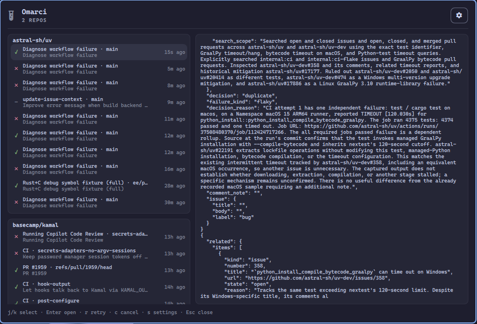

# Omarci

CI in the [Omarchy](https://omarchy.org/) bar: your GitHub Actions runs, and local jobs.

Tell it which repos to watch and the bar shows a test-tube pill: a spinner while a run is in progress, red when your latest run failed, green when it passed. Click it for each repo's latest runs, with Open, Re-run and Cancel, and a desktop notification when a run you started finishes. Scripts can also report local jobs to the same pill.



## Install

```bash
omarchy plugin add https://github.com/matiacone/omarci.git --enable
ln -sf ~/.config/omarchy/plugins/io.github.matiacone.omarci/bin/omarci ~/.local/bin/omarci
```

The widget lands on the right. Move it if you want:

```bash
omarchy bar move io.github.matiacone.omarci --section right --before omarchy.agents
```

## Watch GitHub Actions

Needs the [GitHub CLI](https://cli.github.com/) signed in (`gh auth login`); omarci uses its login and nothing else.

Add repos from the panel (**Settings** → **Watched repos**, paste `owner/repo` or a github.com URL), or from a terminal:

```bash
omarci repos add owner/repo
omarci repos remove owner/repo
omarci repos              # list
```

The panel is one view. Down the left, a card per watched repo with its latest 10 runs (status, workflow, branch, commit title, how long ago), then your local jobs. On the right, the selected run's jobs and steps and the tail of its log (the failed jobs' log when something failed), or the selected local job's log. The actions for the selection sit top right. The widget refreshes every 15 s while a run is in progress and every minute otherwise.

| Key | Action |
| --- | --- |
| `j` / `k` | Select a run or job |
| `Enter` | Open the run on github.com, or the job's log |
| `R` | Re-run failed jobs |
| `c` | Cancel a running run |
| `l` | Full log in a terminal |
| `x` | Dismiss a local job |
| `d` | Dismiss all finished local jobs |
| `r` | Refresh now |
| `s` | Settings (watched repos, notifications) |

The buttons top right do the same, plus **Re-run all**. The same actions work from a terminal:

```bash
omarci gh sync                              # refresh now
omarci gh open owner/repo RUN_ID
omarci gh rerun owner/repo RUN_ID [--failed]
omarci gh cancel owner/repo RUN_ID
omarci gh log owner/repo RUN_ID [--all]     # failed jobs' log, or all of it
omarci gh view owner/repo RUN_ID            # jobs, steps and log tail as JSON
```

## Local jobs

```bash
# Wait for a command. Exit status is the command's. The bar tracks it live.
omarci run --name "neutron signoff" -- ./scripts/signoff.sh

# Fire and forget. Prints a job id. Notification when it finishes.
omarci run --bg --name types -- bun run check-types

# Status bus for a script that already runs the work:
id=$(omarci start --name types)
bun run check-types >"$(omarci show "$id" | jq -r .log)" 2>&1
omarci pass "$id" -m "ok"
# or: omarci fail "$id" -m "tsc exited 1"
```

Local jobs show in the same list, under the repos. Turn notifications off in **Settings** (top right) to stop `notify-send` from the CLI as well.

```bash
omarci list
omarci logs <id>
omarci dismiss <id>
omarci clear          # dismiss finished jobs
omarci clear --prune  # drop dismissed jobs and their logs
```

`OMARCI_NOTIFY=0`, `--no-notify`, or the widget toggle skips toasts. `OMARCI_DIR` overrides the state directory (`$XDG_STATE_HOME/omarci`).

A successful `omarci run` exits 0, so compose a follow-up yourself:

```bash
omarci run --name signoff -- ./scripts/signoff.sh && gh pr merge
```

There is no built-in hook on pass.

## Update

```bash
omarchy plugin update io.github.matiacone.omarci
```

## Uninstall

```bash
omarchy plugin remove io.github.matiacone.omarci
rm -f ~/.local/bin/omarci
```

Job history in `~/.local/state/omarci/` is left in place.

## Security

Omarci runs unsandboxed inside `omarchy-shell` when enabled. Review the source before installing.

- **Files:** reads and writes `$XDG_STATE_HOME/omarci/` (job index, logs, settings with the watched repos, and `github.json` with their latest runs). Toggling notifications may update this plugin's entry in `~/.config/omarchy/shell.json`.
- **Commands:** `gh` for everything GitHub (it uses your `gh` login; omarci never sees a token); `xdg-open` to open a run; `notify-send` on pass/fail; `omarchy-launch-tui less` when you open a log; `omarci run` executes the command you pass it.
- **Network:** only through `gh`, to the GitHub API, for the repos you watch: reading runs, and re-running or cancelling the ones you choose.
- **Privilege:** no sudo, no install hooks.

## License

MIT
